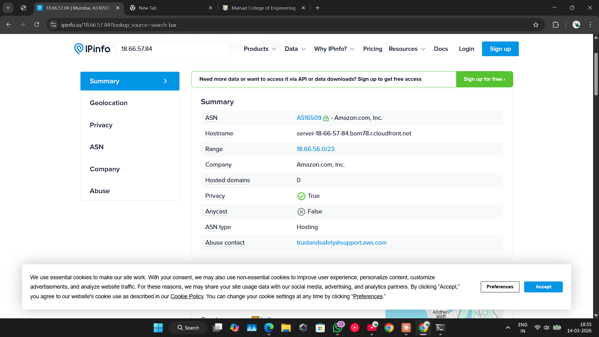
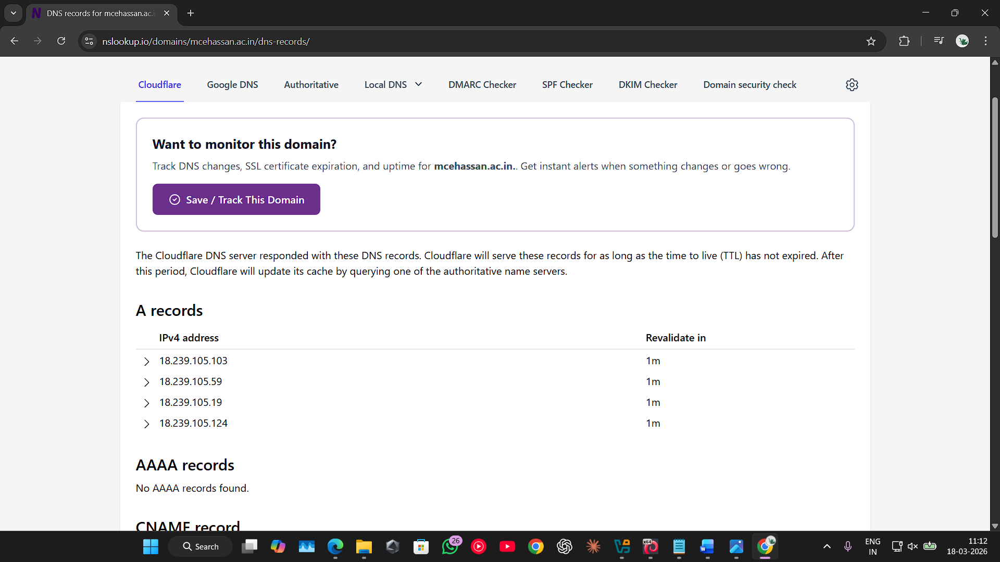
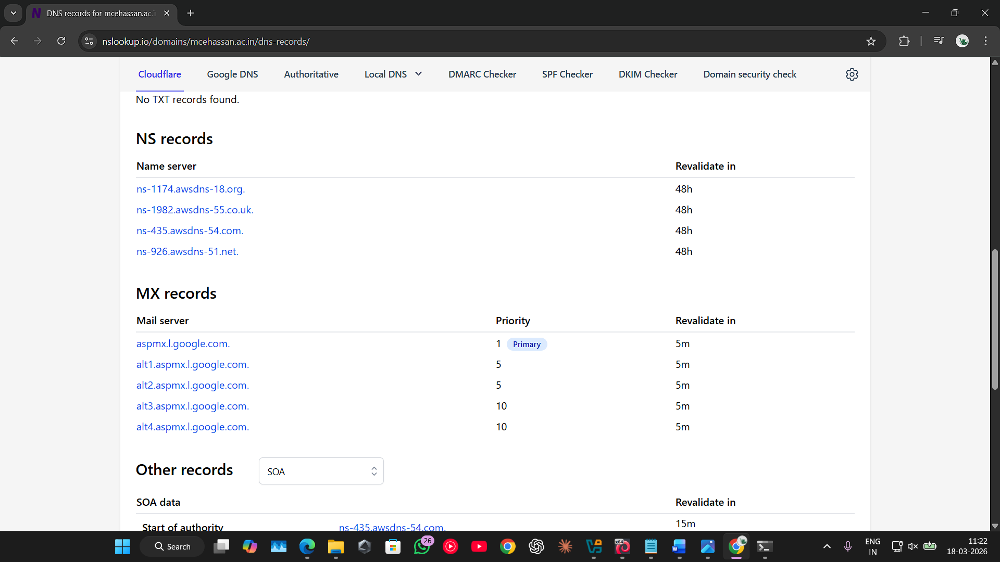

# 🔍 OSINT & Passive Reconnaissance Project

##  Overview

This project focuses on performing **Open Source Intelligence (OSINT)** and **passive reconnaissance** on a target domain using publicly available information.
The objective is to gather intelligence **without directly interacting with the target system**, ensuring a legal and non-intrusive approach.

---

##  Objectives

* Identify target infrastructure and hosting details
* Gather domain and DNS information
* Analyze publicly available data exposure
* Understand potential security risks from open-source data

---

##  Tools & Technologies

* **WHOIS** – Domain registration details
* **nslookup / dig** – DNS information gathering
* **traceroute** – Network path analysis
* **Nmap** – Network scanning (non-intrusive)
* **HackerTarget** – Online reconnaissance tools

---

##  Methodology

### 🔹 Phase 1: Domain & Network Identification

* Identified target IP address and hosting provider
* Detected usage of **AWS CloudFront CDN**, indicating traffic masking
* Observed infrastructure linked to **Amazon AWS (AS16509)**

---

### 🔹 Phase 2: DNS & Host Enumeration

* Performed reverse DNS lookups
* Analyzed domain records and subdomain structure
* Identified indirect exposure of infrastructure components

---

### 🔹 Phase 3: Infrastructure Analysis

* Determined hosting environment and ASN details
* Evaluated network-level architecture
* Identified potential entry points from public data

---

### 🔹 Phase 4: Security Observations

* Observed potential password policy patterns
* Identified possible account lifecycle practices
* Noted presence of CDN masking (security + limitation)

---

### 🔹 Phase 5: Data Exposure & Risk Analysis

* Analyzed WHOIS information for sensitive data exposure
* Evaluated risk of **social engineering attacks**
* Categorized exposure level (Low to Medium risk)

---

##  Key Findings

* Target uses **AWS CloudFront CDN**, masking origin server IP
* Infrastructure hosted on **Amazon AWS (AS16509)**
* Public data reveals potential attack surface
* WHOIS and DNS data may aid **social engineering attacks**
* No direct vulnerabilities exploited (passive recon only)

---

##  Risk Assessment

| Category                  | Risk Level |
| ------------------------- | ---------- |
| Data Exposure             | Medium     |
| Infrastructure Visibility | Low        |
| Social Engineering Risk   | Medium     |

---

### Screenshots on obtained details

### IPINFO

### WHOIS Lookup

### DNS Records

### Personal info Lookup

### Faculty Record

---

## 📄 Full Report

👉 [View Detailed Report](./OSINT_Recon_Report.pdf)

---

## ⚠️ Disclaimer

This project was conducted in a **controlled and ethical manner** using only publicly available information.
No active exploitation or unauthorized access was performed.

---

## 🚀 Learning Outcome

* Gained hands-on experience in **OSINT techniques**
* Understood **real-world reconnaissance methodology**
* Learned how attackers gather intelligence before exploitation
* Improved ability to analyze **security risks from public data**

